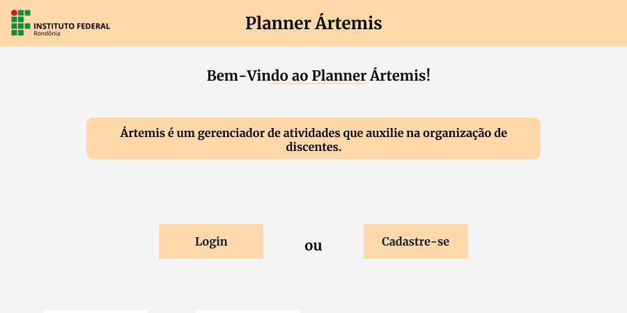
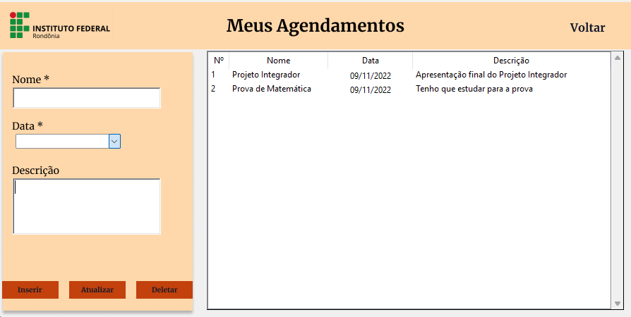

# Protejo Integrador Ártemis

É o projeto integrador desenvolvido por alunos do 2° ano de informática vespertino do Instituto Federal de Educação, Ciência e Tecnologia de Rondônia Campus Porto Velho Calama para obtenção de notas nas disciplinas de Banco de Dados, Fundamentos de Análises de Sistemas, Linguagem de Programação e Programação Orientada a Objetos. O objetivo deste projeto é desenvolver as habilidades trabalhadas em cada uma dessas disciplinas criando um planner que auxilie na organização de discentes e doscentes.

### Página Inicial

### Menu de agendamentos

## Tecnologias Utilizadas
- ``Python``
- ``Tkinter``
- ``SQLite``

## Contato
 
 | [ Marcos Reis Dutra](https://github.com/Marqueba) |[ Nicolle Cristini Dias](https://github.com/Nicolledias13) |
| :---: | :---: | 
| [ Isabella Cristina Queiroz](https://github.com/isabug05) |[ João Pedro Monteiro Ferreira](https://github.com/Joao-Pedro-m) |

